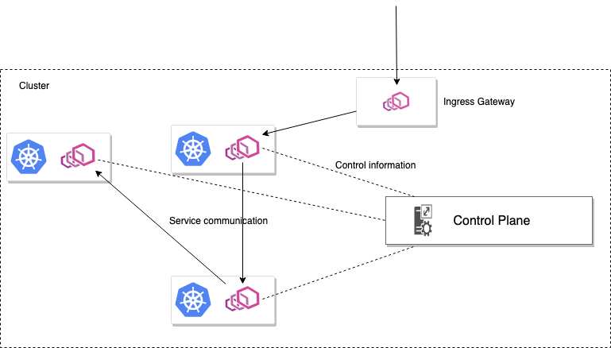
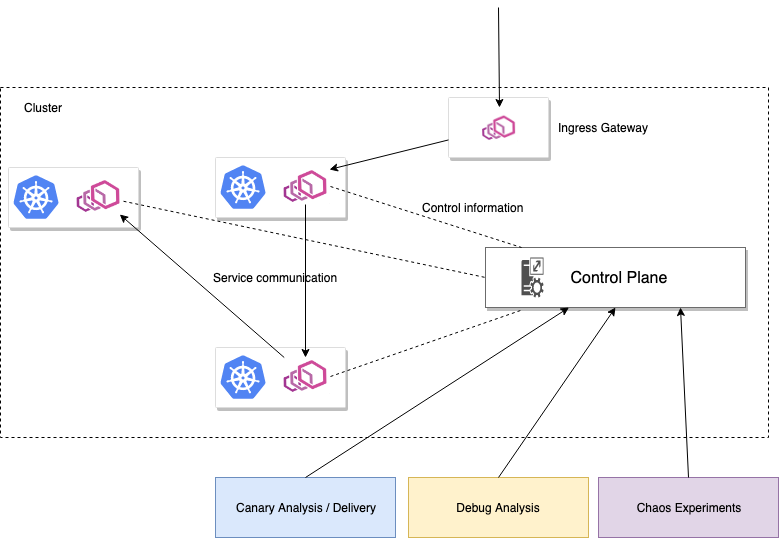
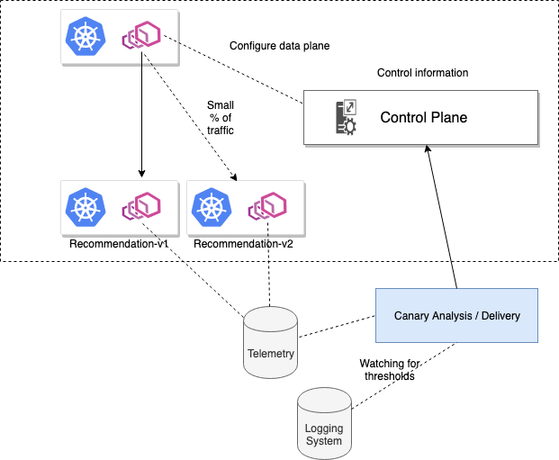
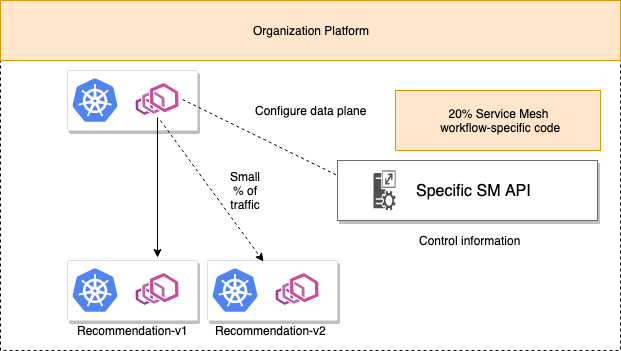

# Towards Building an Open API For Consolidating and Federating Service Meshes

Organizations are trying to modernize their software stack with cloud-native technologies and infrastructure that can greatly improve their ability to quickly and safely deliver software. As our applications  become more decentralized, and our infrastructure more "cloudy", maintaining availability, correctness and safety when doing dozens (or more) releases per day becomes very difficult. Kubernetes and containers has helped us standardize on a packaging and deployment model based on "immutable delivery", but once those applications are deployed, they need to communicate with each other over the network. This situation presents numerous challenges for developers and operators. Service mesh gives us a foundational framework from which to build and operate services that go a long way to solving some of the challenges of application networking and safe, progressive, delivery. 

Services operators and application developers need to solve for service-to-service communication challenges like service discovery, client-side load balancing, configuring transport security, identity provisioning, traffic routing/shaping, communication resilience with circuit breaking, network request observability, and many others. Across languages and frameworks, this can be a very error-prone and tedious exercise. If you build it for one language, how do you end up supporting other languages? If you've built it for one cloud-platform, is it extendable to others? Service mesh solves these problems by injecting a service proxy next to each workload, through which that workload interacts with any other services over the network, that is able to transparently and consistently solve these issues.

A service proxy is typically dedicated to a particular workload instance and they are not shared with other instances within the cluster. This collection of service proxies is known as the "data plane". All requests to services in a service mesh flow through these proxies and are intercepted through the proxy and enriched with powerful behavior like retries, timeouts, circuit breaking, service discovery, load balancing and much more. Envoy Proxy is an open-source service proxy that is a popular choice for implementing a service mesh. Since all requests to and from a workload instance traverse its service proxy, the proxies can capture metrics about the request and affect a change to the communication over the network. The operator of a service mesh interacts with the control plane which is a set of components that lives outside of the request path that supports the data plane. 



Service mesh follows the 80/20 rule. Service mesh can get you 80 percent of the way to solving these application-networking problems in a cloud, language, and framework-agnostic way. The last 20 percent involves writing your own "glue code" to drive and operate the service mesh to "orchestrate it" to deliver a valuable higher-order service. The service mesh exposes a set of powerful individual capabilities, but for your organization to take full advantage of it, you'll need to integrate and combine them for your organization. Examples of higher-order services enabled by service mesh include smart auto-scaling/back-pressure, progressive delivery, traffic-pattern detection, chaos injection and analysis, request provenance and chain-of-custody, zero-trust networking practices, and A/B experiments (which is a more mature version of progressive delivery). A service mesh has the ability to get you 80% of the way there, but to really achieve these capabilities, you need to extend the mesh with 20% your code. 




## Building on top of the service mesh to reduce risk

Let's look at a single example that combines multiple features of a service mesh to help us get to our end goal of reducing risk when making changes to our system.

[Progressive delivery](https://redmonk.com/jgovernor/2018/08/06/towards-progressive-delivery/) is a term coined by Sam Guckenheimer product owner of Azure Devops and Redmock analyst James Grovernor in 2018 to describe the approach to progressively exposing new application functionality in such a way that reduces the blast radius of bad behaviors. Using a combination of traffic control, feature flagging, request routing, and metrics collection, one could build a powerful CI/CD pipeline following progressive delivery techniques that can reduce the risk of delivering new code and code changes. 


Without changing any application/service code to do routing, we could leverage the service mesh as a framework to build a progressive-delivery capability orchestrating capabilities like traffic control, request routing, and metric collection. If we want to make a change to a recommendation service for example, we could deploy a new version and finely control which users get routed to this new deployment. Following a progressive delivery approach, we could deploy v2 of our `recommendation` service into production and only expose it to internal employees. We would then observe the metrics and logs for the new service and set certain thresholds for what it means to continue our delivery. If we find that this new version behaves undesirably, we can roll it back (or reduce traffic) thus limiting its blast radius. For example, if we notice more failures, or higher latency in request processing, we can halt the progressive delivery of this canary and maybe even roll it back. If things look good, we can open up the traffic to more users (say, 1% of live users).  We can follow this approach, slowly unveiling the new service to other groups of users, watching its indicators through metrics and logs, and either continue rollout or roll back. 

A service mesh is implemented with a control-plane/data-plane architecture where the data plane is the individual service proxies through which request metrics are collected and request routing control can be enforced. The control plane is the set of components, outside of the request path, that operators and users can interact with to collect metrics, establish policy, and affect configuration changes to the data plane. 


A control plane has an API surface or some opinionated approach to driving configuration for the mesh. In most open-source service mesh implementations, we typically see a declarative configuration/API surface with a "declarative intent" with the service mesh responsible for "reconciling that intent". For example, with [Istio](https://istio.io) -- an open-source service mesh -- configuration is declared as YAML resources that describe the intent of service-network behavior and the Istio control plane synthesizes this intent into configuration for the service proxies. 

For a `recommendation` service, we may want to control traffic to a canary release by splitting the percentage of traffic that gets routed to each version. In Istio we can use a `VirtualService` to do that:


```yaml
apiVersion: networking.istio.io/v1alpha3
kind: VirtualService
metadata:
  name: recommendation-vs
spec:
  hosts:
  - recommendation.prod.svc.cluster.local
  http:
  - route:
    - destination:
        host: recommendation.prod.svc.cluster.local
        subset: v1
      weight: 90
    - destination:
        host: recommendation.prod.svc.cluster.local
        subset: v2        
      weight: 10
```

Istio also collects metrics from the service proxies using statsD, Prometheus, and/or Jaeger for distributed tracing. These metrics can then be syndicated to your backend analytics engines. They can also be used to make important decisions and form a feedback look about whether to continue with the delivery/release process. Using these signals, we may instruct the service mesh to route 20% of live traffic to the canary if things are going well, or we may scope back the amount of traffic (maybe even all of it) if our signals tell us this new version is behaving adversely.



Another implementation of a service mesh, [AWS App Mesh](https://aws.amazon.com/app-mesh/), uses a similar declarative API for describing traffic routing rules. We create JSON resources and feed that to the App Mesh control plane which then synthesizes the intent into Envoy configuration (Envoy is used as the App Mesh data plane as well):

```json
{
    "routeName": "recommendation-route",
    "spec": {
        "httpRoute": {
            "action": {
                "weightedTargets": [
                    {
                        "virtualNode": "recommendation-v1-vn",
                        "weight": 9
                    },
                    {
                        "virtualNode": "recommendation-v2-vn",
                        "weight": 1
                    }
                ]
            },
            "match": {
                "prefix": "/"
            }
        }
    },
    "virtualRouterName": "recommnedation-vr"
}
```
AWS App Mesh can deliver metrics and request telemetry to CloudWatch, X-Ray, et. al. from which your progressive-deliver engine can evaluate whether to continue opening the traffic flow to your new versions.

Other service mesh implementations like [Linkerd](https://linkerd.io) and [Consul Connect](https://www.consul.io) are working on their traffic-control APIs but will likely follow a similar pattern.

As we consider our progressive delivery implementation on top of a service mesh, we can start to see what parts are the 80% and what parts are the 20%. Although a service mesh can both collect metrics about whats happening at the service/request level and it can help shift/restrict/route traffic to services, it cannot know the process for service promotion or rollback including thresholds/high watermarks that should be used as triggers to open the service up to more users vs rollback to fewer. That control logic, which can be very opinionated and organization dependent, will be the 20% of glue code an organization will need to write on top of the service mesh. To do this, the organization will need to use the specific service-mesh control plane APIs. 

## The need for an open, service-mesh API

As an organization begins to build out its progressive delivery capabilities, or any capabilities on top of a service mesh as described previously, it will necessarily build its glue code around the specific service-mesh API it has decided to adopt. At the moment, for all service mesh implementations, these APIs are changing and evolving. Smart organizations have begun building out their own specific configuration APIs that more cleanly express their intents, fits in better with the value-added services they build on top of service mesh, and abstracts them from constant API churn. They then use a translation layer to convert their configurations into the specific service-mesh implementation APIs. By abstracting away the specific service-mesh APIs, an organization can limit the impact of any one specific service-mesh API implementation details especially when upgrading and finding non-backward compatible changes. 



Another advantage to abstracting away service-mesh-specific APIs is the ability to swap out service mesh technologies at a later point without disrupting the valuable 20% code and functionality that's been written on top of a particular service mesh. In fact, as service-mesh implementations continue to evolve, we'll see those that are very focused or specialized for a certain area of mesh capabilities (let's say, security or observability), while others find their strengths in other areas (let's say pluggable policy). Having a separate, mesh-agnostic, API allows an organization to federate and plug/play certain mesh capabilities. 

Lastly, as organizations attempt to unify their processes/deployments on premises with those they run in a public cloud, a single API for abstracting away the network becomes invaluable. The tooling you may have written to extend Istio for on premises workloads can still be used when deploying into AWS. For example, AWS's App Mesh is an AWS-native service mesh and if you deploy to AWS, it makes sense to leverage their native service mesh especially since it's free. With a single, unified API for your service mesh and capabilities built upon it, you don't have to re-create the wheel when adopting new platforms and can safely build on top of it and extend it.

On one hand, leading organizations have been cobbling together this "informal, mesh-agnostic API" for the reasons listed above, on the other hand it's a bit of a waste for every organization to do this. What if we could collaborate in an open-source project to provide a stable API on service mesh implementations that give us the flexibility to adopt the solutions we need/want, plug and play where needed, and also confidently own the 20% integration glue code on top of our mesh infrastructure?

## One approach to building an open, service mesh API

[SuperGloo is an open-source project](https://supergloo.solo.io) building an open, stable, mesh-agnostic API. With a [simplified service-mesh API](https://supergloo.solo.io/v1/) that can be used to abstract any service mesh, we can achieve the following extension and management goals:

* Create a consistent, simplified experience for installing any service mesh
* Build extensions to a service mesh (using 20% glue code) and hedge any upheaval in the service-mesh landscape (adoption choices, version changes, best-of-breed, etc)
* Discover service mesh implementations and resources and manage them
* Manage multiple implementations of service mesh installations under a single pane of glass and API
* Manage multiple clusters of one or more implementations of service mesh

[SuperGloo has APIs](https://supergloo.solo.io/v1/) for installing and understanding the capabilities of a service mesh with the `Install` and `Mesh` configuration objects, respectively. For example, the installation of Linkerd using SuperGloo's `Install` API looks like this:

```
- apiVersion: supergloo.solo.io/v1
  kind: Install
  metadata:
    creationTimestamp: "2019-05-01T14:12:58Z"
    generation: 1
    name: linkerd
    namespace: supergloo-system
    resourceVersion: "5571565"
    selfLink: /apis/supergloo.solo.io/v1/namespaces/supergloo-system/installs/linkerd
    uid: 389b5e09-6c1b-11e9-92c9-42010a8000c0
  spec:
    installationNamespace: linkerd
    mesh:
      linkerd:
        enableAutoInject: true
        enableMtls: true
        version: stable-2.3.0
```

The mesh features itself are surfaced in the `Mesh` config:

```
- apiVersion: supergloo.solo.io/v1                                                                                     
  kind: Mesh                                                                                                                                                        
  metadata:                                            
    creationTimestamp: "2019-05-01T14:13:09Z"
    generation: 1                                                          
    labels:                        
      created_by: mesh-discovery     
      discovered_by: linkerd-mesh-discovery
    name: linkerd                                                                  
    namespace: supergloo-system    
    resourceVersion: "5571484"           
    selfLink: /apis/supergloo.solo.io/v1/namespaces/supergloo-system/meshes/linkerd
    uid: 3f70f63e-6c1b-11e9-92c9-42010a8000c0
  spec:                            
    discoveryMetadata:                       
      enableAutoInject: true       
      injectedNamespaceLabel: linkerd.io/inject
      installationNamespace: linkerd
      meshVersion: stable-2.3.0      
      mtlsConfig:                                                                  
        mtlsEnabled: true                    
    linkerd:                                   
      installationNamespace: linkerd
      version: 2.3.0                                      
    mtlsConfig:                              
      mtlsEnabled: true  
```      

The equivalent usage for both Istio and AWS App Mesh would be similar. Things become interesting when we define traffic rules for a mesh. For example, with SuperGloo, we can assign traffic rules to a mesh with the `RoutingRule` API. To specify a weighted-routing rule to shift traffic between v1 and v2 of a `reviews` service, we could do the following:


```yaml
- apiVersion: supergloo.solo.io/v1
  kind: RoutingRule
  metadata:
    name: example-routing
    namespace: supergloo-system
  spec:
    destinationSelector:
      upstreamSelector:
        upstreams:
        - name: default-reviews-9080
          namespace: supergloo-system
    spec:
      trafficShifting:
        destinations:
          destinations:
          - destination:
              upstream:
                name: default-reviews-v1-9080
                namespace: supergloo-system
            weight: 2
          - destination:
              upstream:
                name: default-reviews-v2-9080
                namespace: supergloo-system
            weight: 1
    targetMesh:
      name: istio
      namespace: supergloo-system
```

Note that SuperGloo routes to `Upstreams` which is another API object used to abstract the specific backend destination and version combinations. These `Upstreams` are automatically discovered based on labels (e.g., in Kubernetes or possibly in Consul) and you don't have to explicitly create them (although you can if you need). `Upstreams` automatically detect different versions, so you can have `v1` and `v2` of an upstream and select them in `RoutingRule` respectively. `RoutingRule` also includes the ability to specify a `sourceSelector` so you can select the origin of traffic coming to a destination to which that `RoutingRule` applies. Under the covers, these objects create the necessary mesh-specific objects. 

These objects apply to any service-mesh implementation. To see the full API, [check the documentation](https://supergloo.solo.io/v1/). At the moment, SuperGloo supports Istio, Linkerd, and AWS App Mesh with support for more meshes like Consul coming soon. 

The unification of the APIs around specific service mesh implementations allows us to use SuperGloo to manage any service mesh implementation consistently including more complicated scenarios where you may have multiple meshes and multiple clusters (even if just multiple clusters of a single mesh). Any of the 20% code we write can stay mesh agnostic and provide valuable extensions on top of a mesh. A great example of this is building progressive-deliver capabilities. In fact, the [Flagger](https://github.com/weaveworks/flagger) project from Weaveworks did just this and [can leverage SuperGloo to stay mesh agnostic](https://docs.flagger.app/install/flagger-install-with-supergloo).

## Final thoughts

As organizations continue to adopt service-mesh technology and build upon it, they will be weary to tie their valuable 20% code to any one implementation until a clear winner or standard emerges. Even with a single implementation, things move fast, APIs change, and this turbulence can wreak havoc at an organization that cannot wait to implement the kinds of solutions that a service mesh brings. With SuperGloo, you can hedge against this volatility, own your 20% code, and even tackle the more advanced use cases of federating multiple meshes or multiple clusters. 