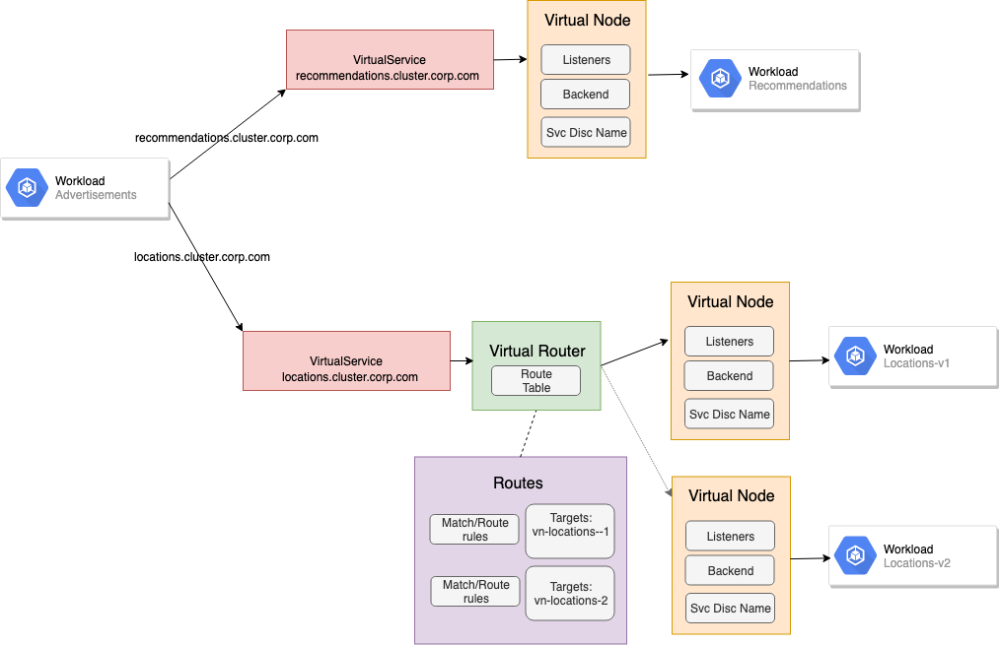

# AWS App Mesh the easy way with Solo SuperGloo

In March 2019, AWS [announced general availability](https://aws.amazon.com/about-aws/whats-new/2019/03/aws-app-mesh-is-now-generally-available/) of [AWS App Mesh](https://aws.amazon.com/app-mesh/) which is a service-mesh implementation that can be run across deployment platforms in AWS such as Fargate, ECS, EKS, EC2 and even your own installation of Kubernetes. App Mesh tries to get the "good parts" of service mesh right without burdening the user with operations and maintenance of the control plane components. App Mesh has a fully-managed control plane that gets scaled, patched, secured, and stores data on behalf of the user, while implementing Envoy's xDS APIs for management of the data plane. With App Mesh, the user can bring their own Envoy proxy or use the out of the box Envoy builds from AWS. 


With the data plane in place, App Mesh can be used to control the routing of traffic between services in your cluster. When workloads within the mesh communicate with each other, they do so by addressing a service's `VirtualService` address. This logical name lines up with the name of the service in a service-discovery registry, for example in Kubernetes it would line up with the FQDN of the Kubernetes service. When addressing a `VirtualService` in App Mesh, the call will resolve to a backend workload, represented by a `VirtualNode`, or it will resolve to a `VirtualRouter` which can abstract away the specific backend workloads (and their versions) and apply matching logic to determine to which backend `VirtualNode` to route. 



In the above example, the `Advertisements` workload is calling out to two different services: `recommendations.cluster.corp.com` and `locations.cluster.corp.com`. Each deployment of the respective services are represented by `VirtualNode`s but for `locations.cluster.corp.com` an App Mesh `VirtualRouter` can be used to control the traffic to the different versions of the `Locations` service. 

As a user of AWS App Mesh, you have to create and apply the correct VirtualNode/VirtualRouter/VirtualService definitions for the mesh capabilities you want (just like other meshes). With [SuperGloo](https://supergloo.solo.io), an open-source project helping to lower the bar to adopting and managing service mesh,  you can automate a lot of these steps and leverage tooling to improve your App Mesh experience. Let's take a quick look.

## SuperGloo simplifies App Mesh experience

[SuperGloo](https://supergloo.solo.io) is a tool to lower the complexity and cognitive load when adopting and managing service-mesh technologies. At it's heart, SuperGloo leverages a simplified and unifying API that abstracts specific service-mesh implementations and layers a consistent set of management capabilities like traffic routing, integrating with other components in your organization and even federating multiple meshes and making them appear as one. SuperGloo can manage multiple clusters of service mesh regardless of the implementation and regardless of what cloud on which they run. 

SuperGloo can be used to improve the experience around AWS App Mesh. For example, to create a new AppMesh, we can run the `supergloo register appmesh -i` command which will start an interactive prompt to complete your service-mesh registration. If we pass `--auto-inject true` we can also get automatic sidecar proxy (Envoy) injection into the namespaces we specify. The auto-injector  which will automatically create the `VirtualNode` resources for us as well. 

Once we register our mesh, we should see a `Mesh` resource that documents the capabilities of this particular service mesh. This is particularly useful information to have when managing multiple meshes or discovering meshes that already exist. 

```yaml
apiVersion: supergloo.solo.io/v1
kind: Mesh
metadata:
  name: demo-appmesh
  namespace: supergloo-system
spec:
  awsAppMesh:
    awsSecret:
      name: aws
      namespace: supergloo-system
    enableAutoInject: true
    injectionSelector:
      namespaceSelector:
        namespaces:
        - bookinfo-appmesh
    region: us-west-2
    virtualNodeLabel: vn-name
```    

SuperGloo also uses the [Gloo](https://gloo.solo.io) service-discovery mechanisms which means we can discover services running on EC2, Kubernetes, Consul, etc and also automatically form subsets/groups of a particular service based on labels. This is very useful when splitting traffic between different versions of a deployment for a service. 

To perform traffic shifting, we can use the SuperGloo API (implemented as a couple CRDs on Kubernetes for example) or the SuperGloo CLI. For example, routing traffic can be expressed like this:

```yaml
apiVersion: supergloo.solo.io/v1
kind: RoutingRule
metadata:
  name: split-reviews
  namespace: supergloo-system
spec:
  destinationSelector:
    upstreamSelector:
      upstreams:
      - name: bookinfo-appmesh-reviews-9080
        namespace: supergloo-system
  spec:
    trafficShifting:
      destinations:
        destinations:
        - destination:
            upstream:
              name: bookinfo-appmesh-reviews-9080
              namespace: supergloo-system        
        - destination:
            upstream:
              name: bookinfo-appmesh-reviews-v2-9080
              namespace: supergloo-system
          weight: 1
  targetMesh:
    name: demo-appmesh
    namespace: supergloo-system
```

We could also use the CLI:

```bash
supergloo apply routingrule trafficshifting --name split-reviews \
--target-mesh supergloo-system.demo-appmesh --dest-upstreams \
supergloo-system.bookinfo-appmesh-reviews-9080 \
--request-matcher '{ "path_prefix":"/"}' \
--destination supergloo-system.bookinfo-appmesh-reviews-9080:1 \
--destination supergloo-system.bookinfo-appmesh-reviews-v2-9080:1
```
Behind the scenes, these routing declarations will create the necessary AWS App Mesh `VirtualNode`, `VirtualService`, and `VirtualRouter` configurations so you can focus on driving the service mesh to do what you need. SuperGloo keeps the same abstractions for any of the other mesh technologies it supports. 

To see a full example, take a look at this video:

https://www.youtube.com/watch?v=GJevzWHqx84&t=3s


## Wrap up

AWS App Mesh is general available and free to use on AWS properties like EC2, EKS, Fargate, ECS, etc. SuperGloo offers a nice experience for users of AWS App Mesh and takes care of a lot of the heavy lifting of creating/managing `VirtualServices`, `VirtualNodes`, and `VirtualRouters` so you can get the most value out of App Mesh with minimal friction. 

Give [AWS App Mesh](https://aws.amazon.com/app-mesh/getting-started/) and [SuperGloo](https://supergloo.solo.io) a try today. See the docs for more.